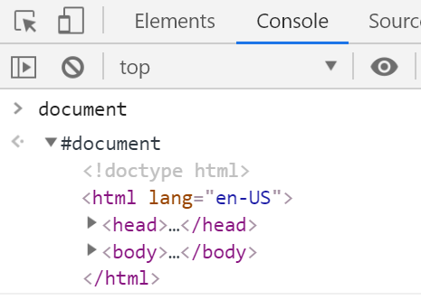
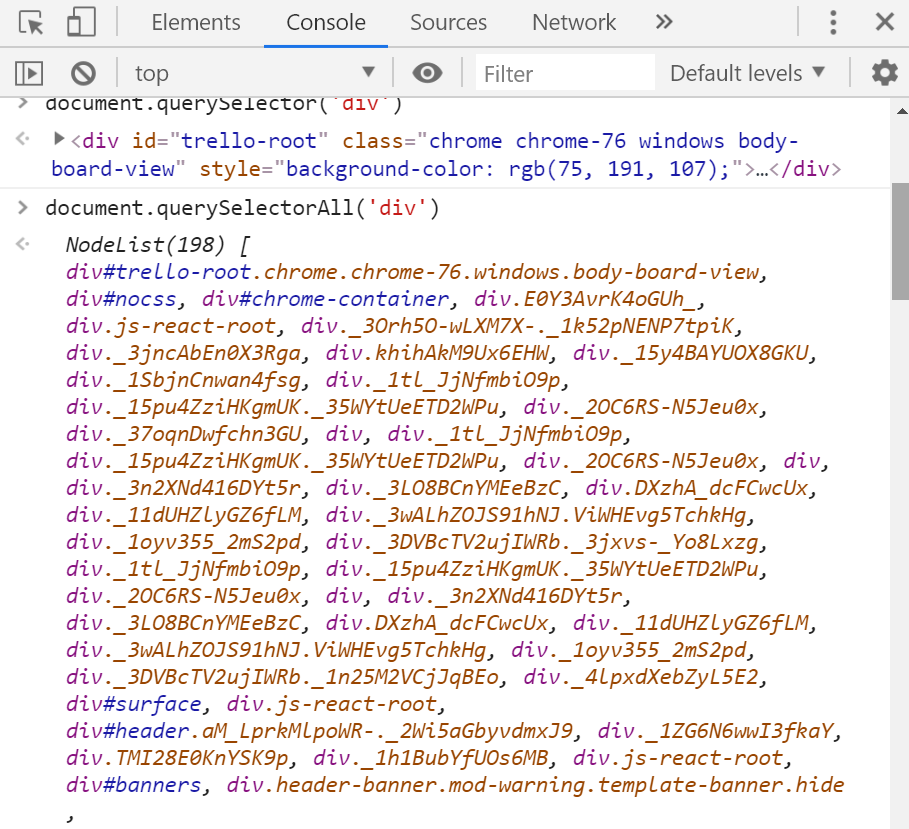
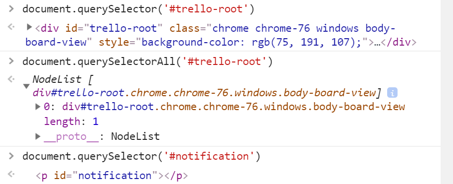
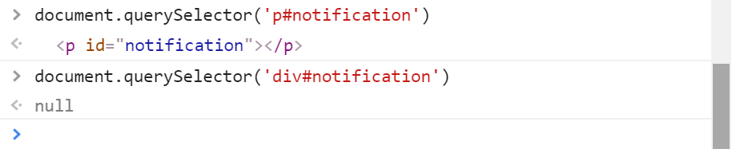

# Javascript Automation

This repository is to learn Javascript automation from scratch.

To start with Javascript automation, you should have fair understanding of the HTML page source code and CSS styling. Let's begin with that.

Open trello dashboard(https://trello.com) in chrome. And open Developer Tools (Ctrl+Shift+I or F12). We gonna play with Elements and Console tabs frequently.

Elements tab allow you to access page source and Console allows you to fire js commands.


# Commands Overview and Object Identification using CSS

--------------------------------------------------------

*Tutorial 1 :  https://youtu.be/oOhQix38a7s*

#### :rocket: What is document

```javascript
document
```

> Document object represents HTML document that is currently open in the browser. It has various properties. The way a document content is accessed and modified is called the Document Object Model, or DOM.

When we type **document** in console and hit ENTER, we get complete html document.




#### :rocket: Methods to select elements on page.

```javascript
document.querySelector(selector)
```

> querySelector functions locate element(s) on the page based on selector given as the argument. It returns single element. If multiple elements exist for the matching criteria, it returns first element.

```javascript
document.querySelectorAll(selector)
```

> querySelectorAll returns list of elements and their count.


#### :rocket: Using Tag Name

```javascript
document.querySelector('div')
```



#### :rocket: Using ID

```javascript
document.querySelectorAll('#trello-root')
```

```javascript
document.querySelectorAll('#notification')
```

> According to css selector rules, **#** symbol is used to search elements using id.




#### :rocket: Using Tag and ID together

```javascript
document.querySelectorAll('p#notification')
```




#### :rocket: 